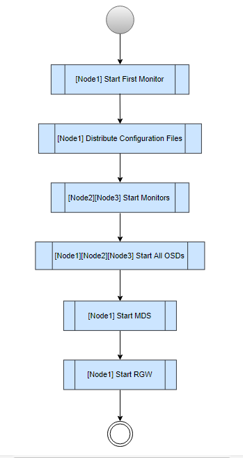
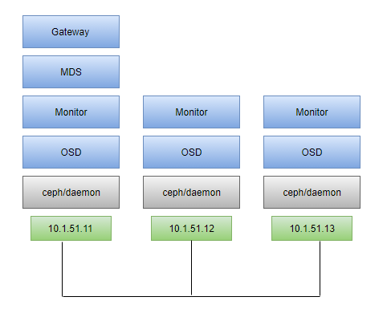

# Environment 

## Sever List 

| Alias |   ServerName  |   IP Address  |   vCPU    |   Memory(GB)  |   HDisk(GB)   | OS |   Descriptions |
|:---:|:---:|:---:|:---:|:---:|:---:|:---:|:---:|
| Node1 |s7cephatom01|10.1.51.11|4|8|sda 20; sdb 40; sdc 40| CentOS Atomic |Monitor, OSD X 2, MSD, RADOSGW|
| Node2 |s7cephatom02|10.1.51.12|4|8|sda 20; sdb 40; sdc 40| CentOS Atomic |Monitor, OSD X 2|
| Node3 |s7cephatom03|10.1.51.13|4|8|sda 20; sdb 40; sdc 40| CentOS Atomic |Monitor, OSD X 2|

> Attention: Here I'm using the CentOS Atomic Operation System. It's one of the container Linux systems like CoreOS. For More detail, please check: [http://www.projectatomic.io/](http://www.projectatomic.io/)

> CentOS Atomic Host is a lean operating system designed to run Docker containers, built from standard CentOS 7 RPMs, and tracking the component versions included in Red Hat Enterprise Linux Atomic Host.

> ISO download: [https://wiki.centos.org/SpecialInterestGroup/Atomic/Download/](https://wiki.centos.org/SpecialInterestGroup/Atomic/Download/)

## Build Process



## Architecture




#

# Prepare

## OS installation 

Same as the CentOS installation. please attention, no package manager , e.g., yum will be installed.

Change Hostname

Change IP Address.

## NTP sync

Login 3 nodes as root. Run below command for time sync.

```bash 
systemctl enable chronyd --now

chronyc waitsync
```

using `date` command to make sure the time has been synced.


### SeLinux Configuration 

Login 3 nodes as root. Run below command for selinux settings. 

```bash
mkdir /var/lib/ceph
sudo chcon -Rt svirt_sandbox_file_t /etc/ceph
sudo chcon -Rt svirt_sandbox_file_t /var/lib/ceph
```


# Install the First Monitor

Login as root

|   ServerName  |   IP Address  |   vCPU    |   Memory(GB)  |   HDisk(GB)   | OS |   Descriptions |
|:---:|:---:|:---:|:---:|:---:|:---:|:---:|
|s7cephatom01|10.1.51.11|4|8|sda 20; sdb 40; sdc 40| CentOS Atomic |Monitor, OSD X 2, MSD, RADOSGW|

### Check OS-Release

```bash
[root@s7cephatom01 ~]# cat /etc/os-release 
NAME="CentOS Linux"
VERSION="7.1705 (Core)"
ID="centos"
ID_LIKE="rhel fedora"
VERSION_ID="7"
PRETTY_NAME="CentOS Linux 7.1705 (Core)"
ANSI_COLOR="0;31"
CPE_NAME="cpe:/o:centos:centos:7"
HOME_URL="https://www.centos.org/"
BUG_REPORT_URL="https://bugs.centos.org/"
CENTOS_MANTISBT_PROJECT="CentOS-7"
CENTOS_MANTISBT_PROJECT_VERSION="7"
REDHAT_SUPPORT_PRODUCT="centos"
REDHAT_SUPPORT_PRODUCT_VERSION="7"
OSTREE_VERSION=7.1705
``` 

### Check IP Address

```bash
[root@s7cephatom01 ~]# ip -4 a
1: lo: <LOOPBACK,UP,LOWER_UP> mtu 65536 qdisc noqueue state UNKNOWN qlen 1
    inet 127.0.0.1/8 scope host lo
       valid_lft forever preferred_lft forever
2: ens160: <BROADCAST,MULTICAST,UP,LOWER_UP> mtu 1500 qdisc mq state UP qlen 1000
    inet 10.1.51.11/25 brd 10.1.51.127 scope global ens160
       valid_lft forever preferred_lft forever
3: docker0: <NO-CARRIER,BROADCAST,MULTICAST,UP> mtu 1500 qdisc noqueue state DOWN 
    inet 172.17.0.1/16 scope global docker0
       valid_lft forever preferred_lft forever

```

### Docker run First Monitor

```bash
docker run -d --net=host -v /etc/ceph:/etc/ceph -v /var/lib/ceph:/var/lib/ceph -e MON_IP=10.1.51.11 -e CEPH_PUBLIC_NETWORK=10.1.51.0/25 ceph/daemon mon
```
result:

```bash
[root@s7cephatom01 ceph]# docker run -d --net=host -v /etc/ceph:/etc/ceph -v /var/lib/ceph:/var/lib/ceph -e MON_IP=10.1.51.11 -e CEPH_PUBLIC_NETWORK=10.1.51.0/25 ceph/daemon mon
Unable to find image 'ceph/daemon:latest' locally
Trying to pull repository docker.io/ceph/daemon ... 
latest: Pulling from docker.io/ceph/daemon
75c416ea735c: Pull complete 
c6ff40b6d658: Pull complete 
a7050fc1f338: Pull complete 
f0ffb5cf6ba9: Pull complete 
be232718519c: Pull complete 
2f2aad2b1ea3: Pull complete 
22ef00d38da4: Pull complete 
e1e113046972: Pull complete 
54889605e220: Pull complete 
f54c8a4103e7: Pull complete 
515945dc0074: Pull complete 
4c936e99ea45: Pull complete 
da7b427c1881: Pull complete 
3bce96d6086f: Pull complete 
Digest: sha256:f3e8174d05d476ef5834c6f3edb6e6f63ed21df561210539ee76315488789ff3
e2b8c1751250ca1647357f828c462c33dc518f7ccfc5fd751cea6e6b8acade34

```

- `MON_NAME`: name of the monitor (default to hostname)
- `CEPH_PUBLIC_NETWORK`: CIDR of the host running Docker, it should be in the same network as the MON_IP
- `CEPH_CLUSTER_NETWORK`: CIDR of a secondary interface of the host running Docker. Used for the OSD replication traffic
- `MON_IP`: IP address of the host running Docker
- `NETWORK_AUTO_DETECT`: Whether and how to attempt IP and network autodetection. Meant to be used without --net=host.
    - 0 = Do not detect (default)
    - 1 = Detect IPv6, fallback to IPv4 (if no globally-routable IPv6 address detected)
    - 4 = Detect IPv4 only
    - 6 = Detect IPv6 only

### Check the Container and get the container ID

```bash
[root@s7cephatom01 ceph]# docker ps
CONTAINER ID        IMAGE               COMMAND                CREATED              STATUS              PORTS               NAMES
e2b8c1751250        ceph/daemon         "/entrypoint.sh mon"   About a minute ago   Up About a minute                       romantic_bell 
```

### Check the ceph status

Change the ${docker-id} with the real mon container id.

```bash
docker exec ${docker-id} ceph -s
```

Now we see a monitor is up.

```bash
[root@s7cephatom01 ceph]# docker exec e2b8c1751250 ceph -s
    cluster 380ef13f-de5f-4988-9ded-37991916078f
     health HEALTH_ERR
            no osds
     monmap e2: 1 mons at {s7cephatom01.buyabs.corp=10.1.51.11:6789/0}
            election epoch 4, quorum 0 s7cephatom01.buyabs.corp
        mgr no daemons active 
     osdmap e1: 0 osds: 0 up, 0 in
            flags sortbitwise,require_jewel_osds,require_kraken_osds
      pgmap v2: 64 pgs, 1 pools, 0 bytes data, 0 objects
            0 kB used, 0 kB / 0 kB avail
                  64 creating
```

# Distribute the Configuration Files

### Check the ceph configuration files on the ${Node1}

```bash
[root@s7cephatom01 ~]# ls /etc/ceph
ceph.client.admin.keyring  ceph.conf  ceph.mon.keyring  rbdmap
```

```bash
[root@s7cephatom01 ~]# ls /var/lib/ceph/
bootstrap-mds  bootstrap-osd  bootstrap-rgw  mds  mgr  mon  osd  radosgw  tmp
```

```bash
[root@s7cephatom01 ~]# ls /var/lib/ceph/mon/ceph-s7cephatom01.buyabs.corp/
keyring  kv_backend  store.db
```

> Note: If not doing this, it will create new clusters 

### Copy /etc/ceph/ceph* and /var/lib/cephbootstrap-* to the other nodes

```bash
scp -r /etc/ceph/ceph* root@10.1.51.12:/etc/ceph/
scp -r /var/lib/ceph/bootstrap-* root@10.1.51.12:/var/lib/ceph/

scp -r /etc/ceph/ceph* root@10.1.51.13:/etc/ceph/
scp -r /var/lib/ceph/bootstrap-* root@10.1.51.13:/var/lib/ceph/
```

The result will like this:

```bash
ceph.client.admin.keyring                          100%  137     0.1KB/s   00:00    
ceph.conf                                          100%  295     0.3KB/s   00:00    
ceph.mon.keyring                                   100%  553     0.5KB/s   00:00 

ceph.keyring                                       100%  113     0.1KB/s   00:00    
ceph.keyring                                       100%  113     0.1KB/s   00:00    
ceph.keyring                                       100%  113     0.1KB/s   00:00 
```

Go to each node to check if the files are there.

# Start the other Monitors

On the Node1 using `docker exec ${docker-id} ceph -w` to monitor the logs of the cluster.

Login the Node2 , run below command:

```bash
docker run -d --net=host -v /etc/ceph:/etc/ceph -v /var/lib/ceph:/var/lib/ceph -e MON_IP=10.1.51.12 -e CEPH_PUBLIC_NETWORK=10.1.51.0/25 ceph/daemon mon
``` 

Login the Node3 , run below command:

```bash
docker run -d --net=host -v /etc/ceph:/etc/ceph -v /var/lib/ceph:/var/lib/ceph -e MON_IP=10.1.51.13 -e CEPH_PUBLIC_NETWORK=10.1.51.0/25 ceph/daemon mon
``` 

Here you shall see the something like these from the node 1

```bash
2017-07-01 04:36:26.868803 mon.s7cephatom01.buyabs.corp [INF] from='client.? 10.1.51.11:0/2991335875' entity='client.admin' cmd='[{"prefix": "config-key put", "key": "mgr/dashboard/server_addr", "val": "::"}]': finished
2017-07-01 04:53:16.270291 mon.s7cephatom01.buyabs.corp [INF] mon.s7cephatom01.buyabs.corp calling new monitor election
2017-07-01 04:53:18.269598 mon.s7cephatom02.buyabs.corp [INF] mon.s7cephatom02.buyabs.corp calling new monitor election
2017-07-01 04:53:21.278656 mon.s7cephatom01.buyabs.corp [INF] mon.s7cephatom01.buyabs.corp@0 won leader election with quorum 0,1
2017-07-01 04:53:21.279844 mon.s7cephatom01.buyabs.corp [INF] HEALTH_ERR; no osds
2017-07-01 04:53:21.290247 mon.s7cephatom01.buyabs.corp [INF] monmap e2: 2 mons at {s7cephatom01.buyabs.corp=10.1.51.11:6789/0,s7cephatom02.buyabs.corp=10.1.51.12:6789/0}
2017-07-01 04:53:21.290446 mon.s7cephatom01.buyabs.corp [INF] fsmap 
2017-07-01 04:53:21.290704 mon.s7cephatom01.buyabs.corp [INF] osdmap e1: 0 total, 0 up, 0 in
2017-07-01 04:53:21.290858 mon.s7cephatom01.buyabs.corp [INF] mgrmap e1: no daemons active
2017-07-01 04:55:12.936562 mon.s7cephatom01.buyabs.corp [INF] mon.s7cephatom01.buyabs.corp calling new monitor election
2017-07-01 04:55:12.938611 mon.s7cephatom02.buyabs.corp [INF] mon.s7cephatom02.buyabs.corp calling new monitor election
2017-07-01 04:55:14.930196 mon.s7cephatom03.buyabs.corp [INF] mon.s7cephatom03.buyabs.corp calling new monitor election
2017-07-01 04:55:17.944884 mon.s7cephatom01.buyabs.corp [INF] mon.s7cephatom01.buyabs.corp@0 won leader election with quorum 0,1,2
2017-07-01 04:55:17.946765 mon.s7cephatom01.buyabs.corp [INF] HEALTH_ERR; no osds
2017-07-01 04:55:17.985840 mon.s7cephatom01.buyabs.corp [INF] monmap e3: 3 mons at {s7cephatom01.buyabs.corp=10.1.51.11:6789/0,s7cephatom02.buyabs.corp=10.1.51.12:6789/0,s7cephatom03.buyabs.corp=10.1.51.13:6789/0}
2017-07-01 04:55:17.986082 mon.s7cephatom01.buyabs.corp [INF] fsmap 
2017-07-01 04:55:17.986211 mon.s7cephatom01.buyabs.corp [INF] osdmap e1: 0 total, 0 up, 0 in
2017-07-01 04:55:17.986525 mon.s7cephatom01.buyabs.corp [INF] mgrmap e1: no daemons active
```

### Check the status 

```bash
docker exec ${docker-id} ceph -s
docker exec ${docker-id} ceph mon stat
```

Result

```bash
[root@s7cephatom01 ceph]# docker exec e2b8c1751250 ceph -s
    cluster 380ef13f-de5f-4988-9ded-37991916078f
     health HEALTH_ERR
            64 pgs are stuck inactive for more than 300 seconds
            64 pgs stuck inactive
            64 pgs stuck unclean
            no osds
     monmap e4: 3 mons at {s7cephatom01.buyabs.corp=10.1.51.11:6789/0,s7cephatom02.buyabs.corp=10.1.51.12:6789/0,s7cephatom03.buyabs.corp=10.1.51.13:6789/0}
            election epoch 8, quorum 0,1,2 s7cephatom01.buyabs.corp,s7cephatom02.buyabs.corp,s7cephatom03.buyabs.corp
        mgr no daemons active 
     osdmap e1: 0 osds: 0 up, 0 in
            flags sortbitwise,require_jewel_osds,require_kraken_osds
      pgmap v2: 64 pgs, 1 pools, 0 bytes data, 0 objects
            0 kB used, 0 kB / 0 kB avail
                  64 creating
```

```bash
[root@s7cephatom01 ceph]# docker exec e2b8c1751250 ceph mon stat
e4: 3 mons at {s7cephatom01.buyabs.corp=10.1.51.11:6789/0,s7cephatom02.buyabs.corp=10.1.51.12:6789/0,s7cephatom03.buyabs.corp=10.1.51.13:6789/0}, election epoch 8, quorum 0,1,2 s7cephatom01.buyabs.corp,s7cephatom02.buyabs.corp,s7cephatom03.buyabs.corp
```

We will see we have 3 mon now but 0 osd , let's add some osd in the next step.

# Start ALL OSDs

### Check the disks

```bash
[root@s7cephatom01 ~]# ls /dev/sd*
/dev/sda  /dev/sda1  /dev/sda2  /dev/sdb  /dev/sdc
```

As we planed the `/dev/sda` will install the OS system, and the `/dev/sdb`, `/dev/sdc` will be the OSDs.

## start OSD on Node1

Run below command on Node1:

```bash
docker run -d --net=host -v /etc/ceph:/etc/ceph -v /var/lib/ceph/:/var/lib/ceph/ -v /dev/:/dev/ --privileged=true -e OSD_FORCE_ZAP=1 -e OSD_DEVICE=/dev/sdb ceph/daemon osd_ceph_disk
```

```bash
docker run -d --net=host -v /etc/ceph:/etc/ceph -v /var/lib/ceph/:/var/lib/ceph/ -v /dev/:/dev/ --privileged=true -e OSD_FORCE_ZAP=1 -e OSD_DEVICE=/dev/sdc ceph/daemon osd_ceph_disk
```

## Check the docker status 

we will see there containers are runing 

```bash
[root@s7cephatom01 ceph]# docker ps
CONTAINER ID        IMAGE               COMMAND                  CREATED              STATUS              PORTS               NAMES
318a9434d9d7        ceph/daemon         "/entrypoint.sh osd_c"   51 seconds ago       Up 50 seconds                           gigantic_leavitt
1252d3fb971f        ceph/daemon         "/entrypoint.sh osd_c"   About a minute ago   Up About a minute                       hungry_goodall
e2b8c1751250        ceph/daemon         "/entrypoint.sh mon"     46 hours ago         Up 46 hours                             romantic_bell
```

## Repeat on the other nodes

>skip 

## Check the status 

```bash
docker exec ${docker-id} ceph -s
```
Result:

```
[root@s7cephatom01 ceph]# docker exec e2b8c1751250 ceph -s
    cluster 380ef13f-de5f-4988-9ded-37991916078f
     health HEALTH_OK
     monmap e4: 3 mons at {s7cephatom01.buyabs.corp=10.1.51.11:6789/0,s7cephatom02.buyabs.corp=10.1.51.12:6789/0,s7cephatom03.buyabs.corp=10.1.51.13:6789/0}
            election epoch 8, quorum 0,1,2 s7cephatom01.buyabs.corp,s7cephatom02.buyabs.corp,s7cephatom03.buyabs.corp
        mgr no daemons active 
     osdmap e34: 6 osds: 6 up, 6 in
            flags sortbitwise,require_jewel_osds,require_kraken_osds
      pgmap v75: 64 pgs, 1 pools, 0 bytes data, 0 objects
            206 MB used, 718 GB / 719 GB avail
                  64 active+clean
```

We shall see all the pgs are active+clean, and `health HEALTH_OK`.

### Check the OSD trees

```bash
[root@s7cephatom01 ceph]# docker exec e2b8c1751250 ceph osd tree 
ID WEIGHT  TYPE NAME             UP/DOWN REWEIGHT PRIMARY-AFFINITY 
-1 0.71997 root default                                            
-2 0.23999     host s7cephatom01                                   
 0 0.12000         osd.0              up  1.00000          1.00000 
 1 0.12000         osd.1              up  1.00000          1.00000 
-3 0.23999     host s7cephatom02                                   
 2 0.12000         osd.2              up  1.00000          1.00000 
 5 0.12000         osd.5              up  1.00000          1.00000 
-4 0.23999     host s7cephatom03                                   
 3 0.12000         osd.3              up  1.00000          1.00000 
 4 0.12000         osd.4              up  1.00000          1.00000
```

Now we can see 3 mon and 6 osd are up running now.

## Check the ceph pools

```bash
docker exec ${docker-id} ceph osd dump
```

we can see we only have a pool 0

```
[root@s7cephatom01 ceph]# docker exec e2b8c1751250 ceph osd dump | grep pool
pool 0 'rbd' replicated size 3 min_size 2 crush_ruleset 0 object_hash rjenkins pg_num 64 pgp_num 64 last_change 1 flags hashpspool stripe_width 0
```

If you only need the RBD, this will be enough. Want More?! Let's keep going!!!

# Start MDS

On the Node1, run :

```bash
docker run -d --net=host -v /etc/ceph:/etc/ceph -v /var/lib/ceph/:/var/lib/ceph/ -e CEPHFS_CREATE=1 ceph/daemon mds
```

Check the ceph status

```bash
[root@s7cephatom01 ceph]# docker exec e2b8c1751250 ceph -s
    cluster 380ef13f-de5f-4988-9ded-37991916078f
     health HEALTH_OK
     monmap e4: 3 mons at {s7cephatom01.buyabs.corp=10.1.51.11:6789/0,s7cephatom02.buyabs.corp=10.1.51.12:6789/0,s7cephatom03.buyabs.corp=10.1.51.13:6789/0}
            election epoch 8, quorum 0,1,2 s7cephatom01.buyabs.corp,s7cephatom02.buyabs.corp,s7cephatom03.buyabs.corp
      fsmap e5: 1/1/1 up {0=mds-s7cephatom01.buyabs.corp=up:active}
        mgr no daemons active 
     osdmap e38: 6 osds: 6 up, 6 in
            flags sortbitwise,require_jewel_osds,require_kraken_osds
      pgmap v97: 80 pgs, 3 pools, 2148 bytes data, 20 objects
            211 MB used, 718 GB / 719 GB avail
                  80 active+clean
```

MDS is activated.

Check ceph pools

```bash
[root@s7cephatom01 ceph]# docker exec e2b8c1751250 ceph osd dump | grep pool
pool 0 'rbd' replicated size 3 min_size 2 crush_ruleset 0 object_hash rjenkins pg_num 64 pgp_num 64 last_change 1 flags hashpspool stripe_width 0
pool 1 'cephfs_data' replicated size 3 min_size 2 crush_ruleset 0 object_hash rjenkins pg_num 8 pgp_num 8 last_change 38 flags hashpspool crash_replay_interval 45 stripe_width 0
pool 2 'cephfs_metadata' replicated size 3 min_size 2 crush_ruleset 0 object_hash rjenkins pg_num 8 pgp_num 8 last_change 37 flags hashpspool stripe_width 0
```

Great! CephFs is enabled.

# Start radosgw

On the node1, run below command:

```bash
docker run -d -p 80:80 -v /etc/ceph:/etc/ceph -v /var/lib/ceph/:/var/lib/ceph/ ceph/daemon rgw
```

Check the ceph pool and you will see 

```bash
[root@s7cephatom01 ceph]# docker exec e2b8c1751250 ceph osd dump | grep pool
pool 0 'rbd' replicated size 3 min_size 2 crush_ruleset 0 object_hash rjenkins pg_num 64 pgp_num 64 last_change 1 flags hashpspool stripe_width 0
pool 1 'cephfs_data' replicated size 3 min_size 2 crush_ruleset 0 object_hash rjenkins pg_num 8 pgp_num 8 last_change 38 flags hashpspool crash_replay_interval 45 stripe_width 0
pool 2 'cephfs_metadata' replicated size 3 min_size 2 crush_ruleset 0 object_hash rjenkins pg_num 8 pgp_num 8 last_change 37 flags hashpspool stripe_width 0
pool 3 '.rgw.root' replicated size 3 min_size 2 crush_ruleset 0 object_hash rjenkins pg_num 8 pgp_num 8 last_change 39 owner 18446744073709551615 flags hashpspool stripe_width 0
pool 4 'default.rgw.control' replicated size 3 min_size 2 crush_ruleset 0 object_hash rjenkins pg_num 8 pgp_num 8 last_change 41 owner 18446744073709551615 flags hashpspool stripe_width 0
pool 5 'default.rgw.data.root' replicated size 3 min_size 2 crush_ruleset 0 object_hash rjenkins pg_num 8 pgp_num 8 last_change 43 owner 18446744073709551615 flags hashpspool stripe_width 0
pool 6 'default.rgw.gc' replicated size 3 min_size 2 crush_ruleset 0 object_hash rjenkins pg_num 8 pgp_num 8 last_change 44 owner 18446744073709551615 flags hashpspool stripe_width 0
pool 7 'default.rgw.lc' replicated size 3 min_size 2 crush_ruleset 0 object_hash rjenkins pg_num 8 pgp_num 8 last_change 45 owner 18446744073709551615 flags hashpspool stripe_width 0
pool 8 'default.rgw.log' replicated size 3 min_size 2 crush_ruleset 0 object_hash rjenkins pg_num 8 pgp_num 8 last_change 46 owner 18446744073709551615 flags hashpspool stripe_width 0
```

RadosGW is enabled too.

# Review

Docker containers runing on the Node1

```bash
[root@s7cephatom01 ceph]# docker ps
CONTAINER ID        IMAGE               COMMAND                  CREATED             STATUS              PORTS                NAMES
b8e02dfdf66e        ceph/daemon         "/entrypoint.sh rgw"     22 minutes ago      Up 22 minutes       0.0.0.0:80->80/tcp   suspicious_williams
14e3cba222fa        ceph/daemon         "/entrypoint.sh mds"     27 minutes ago      Up 27 minutes                            naughty_franklin
318a9434d9d7        ceph/daemon         "/entrypoint.sh osd_c"   42 minutes ago      Up 42 minutes                            gigantic_leavitt
1252d3fb971f        ceph/daemon         "/entrypoint.sh osd_c"   42 minutes ago      Up 42 minutes                            hungry_goodall
e2b8c1751250        ceph/daemon         "/entrypoint.sh mon"     47 hours ago        Up 47 hours                              romantic_bell
```

Docker containers running on the node2

```bash
[root@s7cephatom02 ~]# docker ps
CONTAINER ID        IMAGE               COMMAND                  CREATED             STATUS              PORTS               NAMES
eb57fd22194c        ceph/daemon         "/entrypoint.sh osd_c"   34 minutes ago      Up 34 minutes                           berserk_swartz
3a424a3d0005        ceph/daemon         "/entrypoint.sh osd_c"   43 minutes ago      Up 42 minutes                           sad_engelbart
b1676c6bd342        ceph/daemon         "/entrypoint.sh mon"     48 minutes ago      Up 48 minutes                           happy_goldwasser
```

Docker containers running on the node3

```bash
[root@s7cephatom03 ~]# docker ps
CONTAINER ID        IMAGE               COMMAND                  CREATED             STATUS              PORTS               NAMES
2c7561e30be9        ceph/daemon         "/entrypoint.sh osd_c"   43 minutes ago      Up 43 minutes                           adoring_lovelace
86024f7b1188        ceph/daemon         "/entrypoint.sh osd_c"   43 minutes ago      Up 43 minutes                           awesome_bose
470a18e0b76c        ceph/daemon         "/entrypoint.sh mon"     48 minutes ago      Up 48 minutes                           goofy_fermat
```

How to make them permanent?

# Create the systemd unit for Ceph docker 

Here is some examples:

Ceph Monitor:

ceph-mon@.service

```bash
[Unit]
Description=Ceph Monitor
After=docker.service

[Service]
EnvironmentFile=/etc/environment
ExecStartPre=-/usr/bin/docker stop %i
ExecStartPre=-/usr/bin/docker rm %i
ExecStartPre=/usr/bin/mkdir -p /etc/ceph /var/lib/ceph/mon
ExecStart=/usr/bin/docker run --rm --name %p --net=host \
   -v /var/lib/ceph:/var/lib/ceph \
   -v /etc/ceph:/etc/ceph \
   --privileged \
   -e CEPH_DAEMON=MON \
   -e MON_IP=10.1.51.11 \
   -e CEPH_PUBLIC_NETWORK=10.1.51.0/25 \
   -e MON_NAME=ceph-mon \
   --name=ceph-mon \
    ceph/daemon
ExecStopPost=-/usr/bin/docker stop %i
Restart=always
RestartSec=10s
TimeoutStartSec=120
TimeoutStopSec=15

[Install]
WantedBy=multi-user.target
```

Ceph OSD: 

ceph-osd@.service

```bash
[Unit]
Description=Ceph OSD
After=docker.service

[Service]
EnvironmentFile=/etc/environment
ExecStartPre=-/usr/bin/docker stop ceph-osd-dev%i
ExecStartPre=-/usr/bin/docker rm ceph-osd-dev%i
ExecStart=/usr/bin/docker run --rm --net=host --pid=host\
   -v /var/lib/ceph:/var/lib/ceph \
   -v /etc/ceph:/etc/ceph \
   -v /dev:/dev \
   --privileged \
   -e CEPH_DAEMON=OSD_CEPH_DISK_ACTIVATE \
   -e OSD_DEVICE=/dev/%i \
   --name=ceph-osd-dev%i \
   ceph/daemon 
ExecStop=-/usr/bin/docker stop ceph-osd-dev%i
Restart=always
RestartSec=10s
TimeoutStartSec=120
TimeoutStopSec=15

[Install]
WantedBy=multi-user.target
```

> Tips

|Unit Specifier|Meaning|Description|
|:---:| :---: |---   |
|%n|Full unit name|Stands for the full unit name including the type suffix. %N has the same meaning but also replaces the forbidden characters with ASCII codes.|
|%p|Prefix name|Stands for a unit name with type suffix removed. For instantiated units %p stands for the part of the unit name before the "@" character.|
|%i|Instance name|	Is the part of the instantiated unit name between the "@" character and the type suffix. %I has the same meaning but also replaces the forbidden characters for ASCII codes.|
|%H|Host name|Stands for the hostname of the running system at the point in time the unit configuration is loaded.|
|%t|Runtime directory|Represents the runtime directory, which is either /run for the root user, or the value of the XDG_RUNTIME_DIR variable for unprivileged users.|